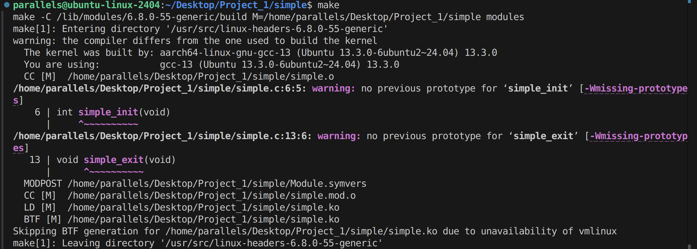
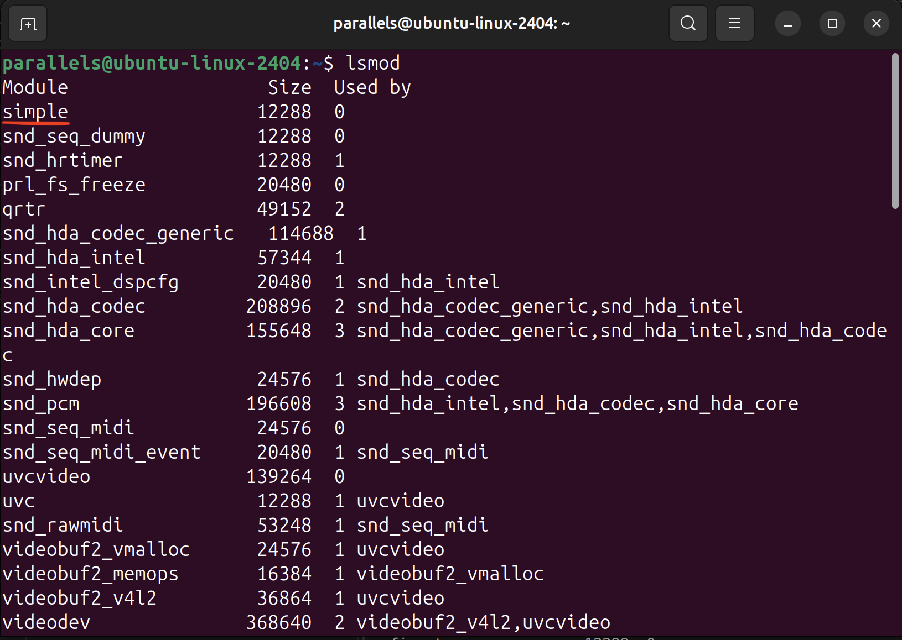
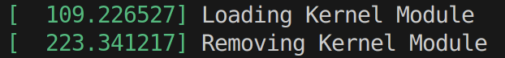
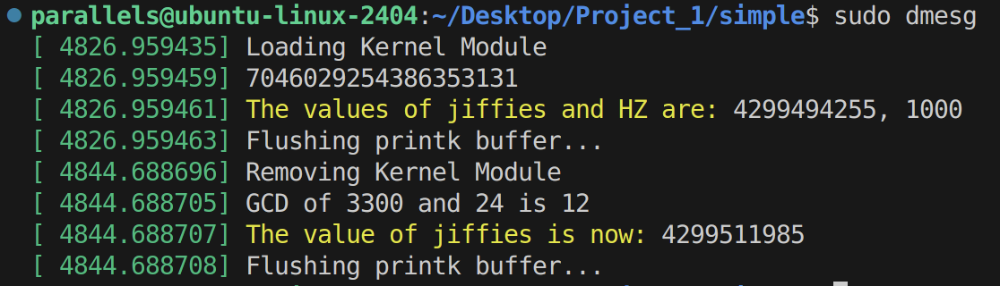
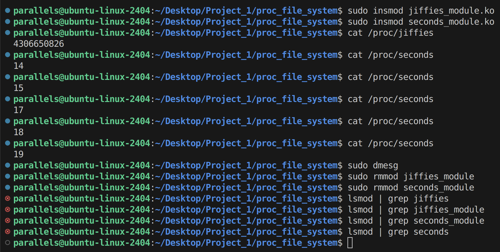

# Project #1 | CMPE 142 - Operating Systems

Experimenting with Linux kernel modules

## Table of Contents

- [FileCopy.c](#filecopyc) — Copy contents from source file to destination file
- [simple.c](#simplec) — Loads kernel module, does some tasks, then removes the module
- [jiffies_module.c & seconds_module.c](#jiffies_modulec--seconds_modulec) — Design of two kernel modules: one that uses kernel /proc file system to store the current value of "jiffies" and print it out to user space, and the second one uses kernel /proc file system to report the number of elapsed seconds since the kernel module was loaded
- [References](#references)

## FileCopy.c

The source code and text file for testing can be found in /Problem_2.24.

Below is the tracing of system calls after running the program using strace on Linux:

## simple.c

The source code, makefile, and compilation files can be found in /simple.

Makefile output:

Checking that module is loaded onto kernel using lsmod:

After inserting into and removing from kernel, the kernel log buffer shows:

Next, added functionality including printing GOLDEN_RATIO_PRIME value, printing current jiffies and HZ values, GCD of 3300 and 24, and value of jiffies upon module removal. The log is shown below:

## jiffies_module.c & seconds_module.c

The source code, makefile, and compilation files can be found in /proc_file_system.

Upon compilation, both jiffies and seconds modules were inserted into the kernel, and their created files are then read in user space using the cat command.

Once the modules are removed from kernel, the /proc directory is checked, using the lsmod command, to ensure the files got deleted.

The log is shown below:

## References

- [programming project #1.pdf](programming_project_1.pdf)
