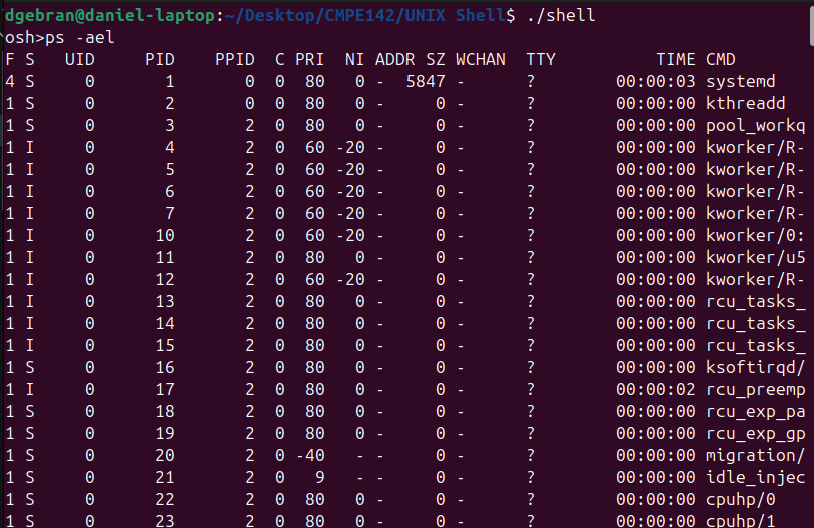
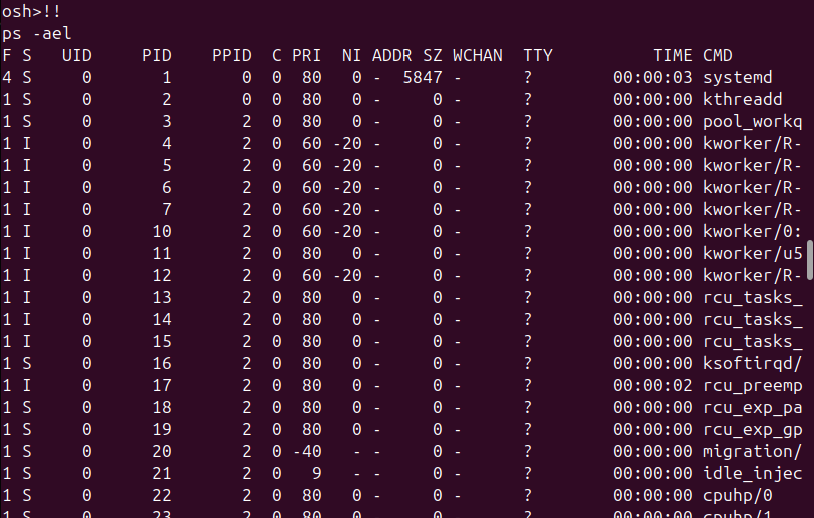
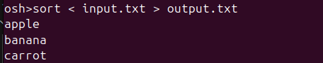

# Project #2 | CMPE 142 - Operating Systems

Experimenting with building a UNIX Shell & Multithreaded Programming

## Table of Contents

- [UNIX Shell](#unix-shell)
  - [Command Excecution in Child Process](#command--execution--in--child--process)
  - [Adding History feature](#adding--history--feature)
  - [Input/Output Redirection](#input/output--redirection)
  - [Communication via Pipe](#communication--via--pipe)
- [Multithreaded Sorting Application](#multithreaded--sorting--application)
  - [Description](#description)
  - [Output](#output)
- [References](#references)

## UNIX Shell

Custom UNIX shell implementation including command execution, history, input/output redirection, and piping.

### Command Excecution in Child Process

First off, the shell interface is implemented by taking a command from user input and executing it. This is done by:

- Prompting the user for a command
- Parsing the input into command + arguments
- Forking a child process to execute the command using execvp()
- Having the parent wait for the child to finish unless the command is to be executed in the background

### Adding History feature

To implement this feature, input is compared with "!!" using strcmp(). If last_command is empty, print "No commands in history". Otherwise, echo the most recent command and copy it from last_command into input to process it. In case the user enters a command different from "!!", last_command gets updated with the new command to retain history.

Ex: ps -ael executed twice

### Input/Output Redirection

Here is an example of attempting both input and output redirection when sorting text in a txt file:

### Communication via Pipe

## Multithreaded Sorting Application

Multithreaded application where two seperate threads are merged to a third thread to merge two sublists in sorted order

### Description

The global array "unsorted" holds the original list. Two threads tid1 and tid2 sort each half of the array using bubble sort, which are then both merged into the "sorted" array through a third thread tid3. As the main thread waits for all others to complete, it then prints the result.

### Output

Upon compiling and running the program, the resulting array is sorted:

## References

[1] A. Silberschatz, P. B. Galvin, and G. Gagne, _Operating System Concepts_, 10th ed. Hoboken, NJ, USA: Wiley, 2018.
