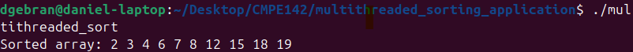

# Multithreaded Sorting Application | CMPE 142 - Operating Systems
Multithreaded application where two seperate threads are merged to a third thread to merge two sublists in sorted order

## Description

The global array "unsorted" holds the original list. Two threads tid1 and tid2 sort each half of the array using bubble sort, which are then both merged into the "sorted" array through a third thread tid3. As the main thread waits for all others to complete, it then prints the result.

## Output

Upon compiling and running the program, the resulting array is sorted:

## References
- Operating System Concepts by Abraham Silberschatz, Peter B. Galvin, and Greg Gagne