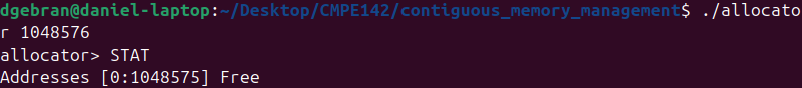
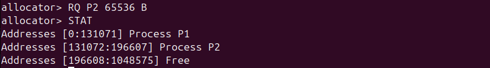
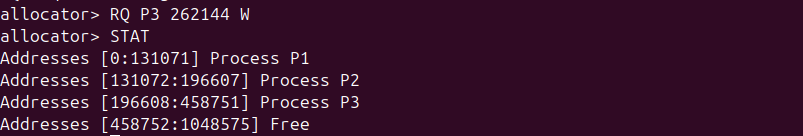
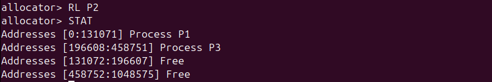

# Contiguous Memory Allocation | CMPE 142 - Operating Systems
Project involving the management of contiguous memory

## Description
Given a contiguous region of memory of size MAX, addresses may range from 0 ... MAX−1. The program must respond to four different requests:
1. Request for a contiguous block of memory
2. Release of a contiguous block of memory
3. Compact unused holes of memory into one single block
4. Report the regions of free and allocated memory

## Output

Upon compiling and running the program, we print an initial status to make sure we begin with one free hole of 1048576 bytes (1 MB):

- First-fit allocation for P1:

- Best-fit allocation for P2:

- Worst-fit allocation for P3:

In this next command for P4, an edge case occurs as we request too much memory to be allocated, which prints an error to the terminal:

Upon releasing memory for P2, compaction occurs in the background as the free hole is merged with the other free ones further down in memory:

## References
- Operating System Concepts by Abraham Silberschatz, Peter B. Galvin, and Greg Gagne