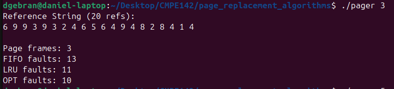
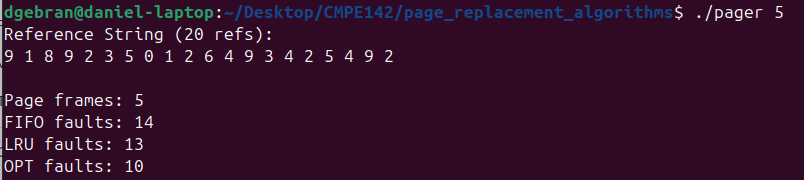
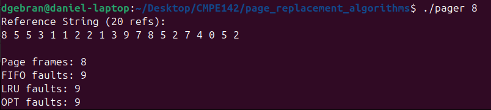
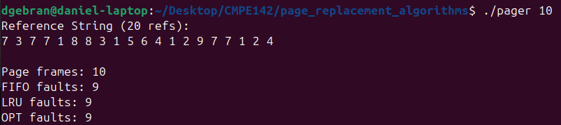

# Page Replacement Algorithm Implementations | CMPE 142 - Operating Systems
Project involving the implementation of the FIFO, LRU, and OPT algorithms.

## Description
Given a randomly-generated page reference string and parsed number of page frames, the program applies the string to all 3 algorithms, records the number of page faults incurred by each of them, and outputs the numbers.

## Output

Upon compiling and running the program, it is tested with the following numbers of page frames: 3, 5, 8, and 10, which are passed as arguments in the command line. For each command, a random reference string is generated.

`./pager 3`

`./pager 5`

`./pager 8`

`./pager 10`

It can be seen that as the number of frames grows toward the page range upper limit, the page replacement algorithms tend to perform similarly.

## References
- Operating System Concepts by Abraham Silberschatz, Peter B. Galvin, and Greg Gagne